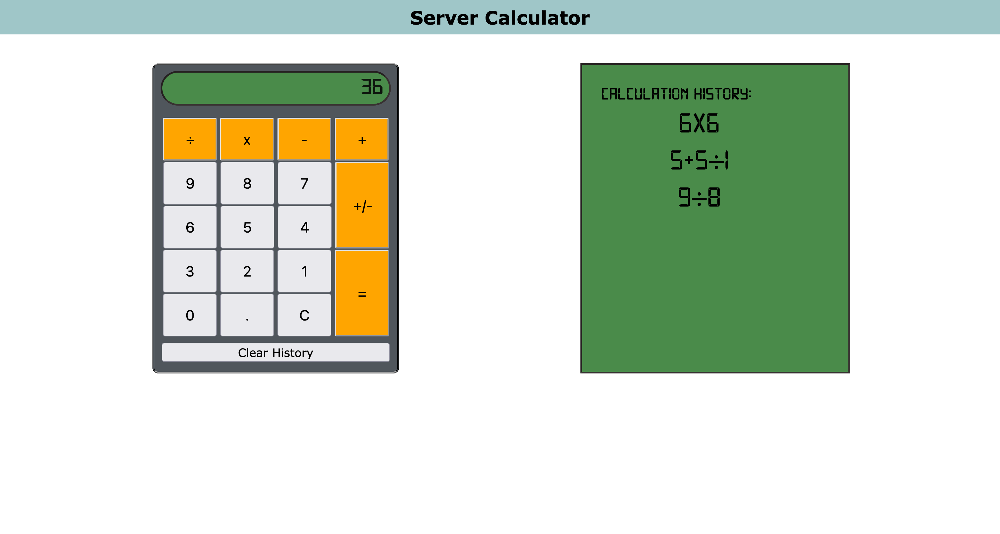

# Server-side Calculator

## Description
*Duration: Weekend assignment*

This assignment required us to build a calculator, combining all of our previously learned elements of DOM manipulation and client-side stack construction alongside the introduction of server-side interaction.

The calculator was to behave like one would expect, with the requirement that all calculations be handled by the server-side. Inputs were to be handed off through POST requests, while the answer was to be returned through a following GET request from the client.

A display of calculation history was also required to be stored on the client side, so it could be maintained despite page reload. If these past calculations were to be clicked, the calculation would re-run in the calculator. History was required to be cleared with a DELETE request. 

Full assignment details can be found in [`INSTRUCTIONS.md`](INSTRUCTIONS.md)

## Final Product Snapshot

## Usage

Type a calculation and press enter to see the result. To re-run a past calculation, click on the equation in the calculation history. 

'Clear History' will permanently erase all past calculations.

## Built With

* HTML
* CSS
* JavaScript
* jQuery
* AJAX
